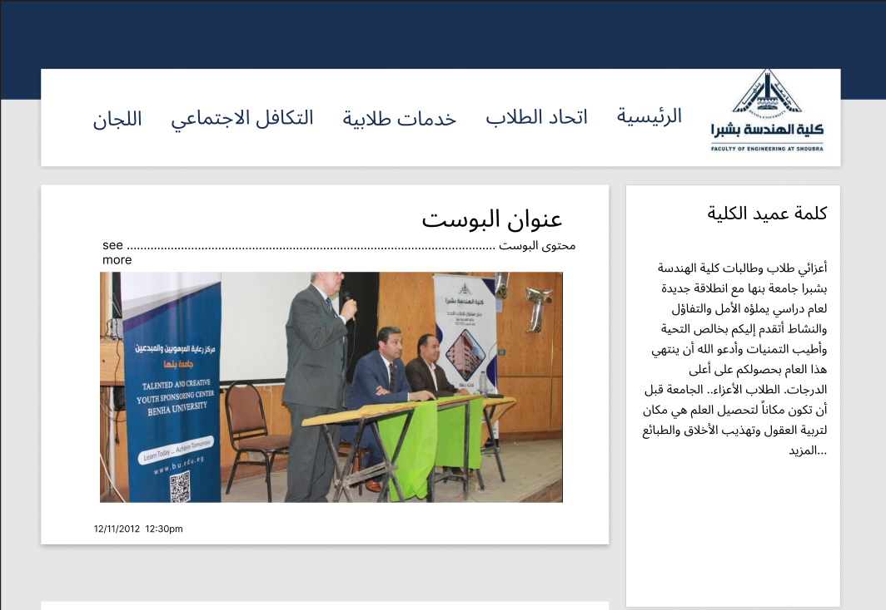

# Youth care
We're building a website to connect our youth care department with their audience -The students- to make it easier to make announcments about social activities, student union elections, Social solidarity, and Student services.
The website allows the admin to:

    - change the website template totally by adding new routes to the navbar.
    - create, update, remove blogs contents 

The Website allows normal user to:

    - check current blogs to follow new youth care announcments

## What we did
- First we approached the youth care department to hear them and analyze their problem.
- Having Realized that the core problem was in communcation between the department and their audience.
- A website supporting both desktop and mobile layout was decided as a solution to this problem.
- Then we approached our advisor Dr.lamia Elrefaee and we got the approval to start working on the project.
- after the approval a meeting was orgnized  with the team to determine the [tech stack](#tech-stack) we will use in the project. 
## Tech stack
- UI/UX

     Using figma to brainstorm and create a design inspired by our collage existing [official website](https://feng.bu.edu.eg/index.php/students/youth-care)

    [***Figma link***](https://www.figma.com/file/y4AtAp9wnCOHRtZDUUL9P5/Youth-care-Webpage?node-id=0%3A1)
    
- Frontend

    - Using HTML5/Css/bootstrap to create our prototype template to then be converted to blade      templates because we're using server side rendring in the backend
    in the backend will be discussed more further
- Backend

    - Databasehttps://www.figma.com/file/y4AtAp9wnCOHRtZDUUL9P5/Youth-care-Webpage?node-id=0%3A1

        Using mysql
    - Backend framework

        Using php/laravel to manage our server and connect to the database to do all CRUD operations on the blogs contents through the admin panel and as we said before we're using server rendering methodology to serve our dynamic webites to the user and the eng22.04.1, and the deisgn pattern used for designing the backend was **MVC**